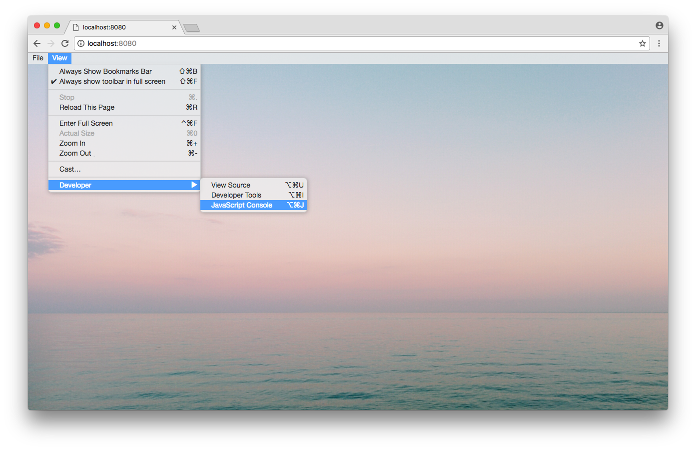
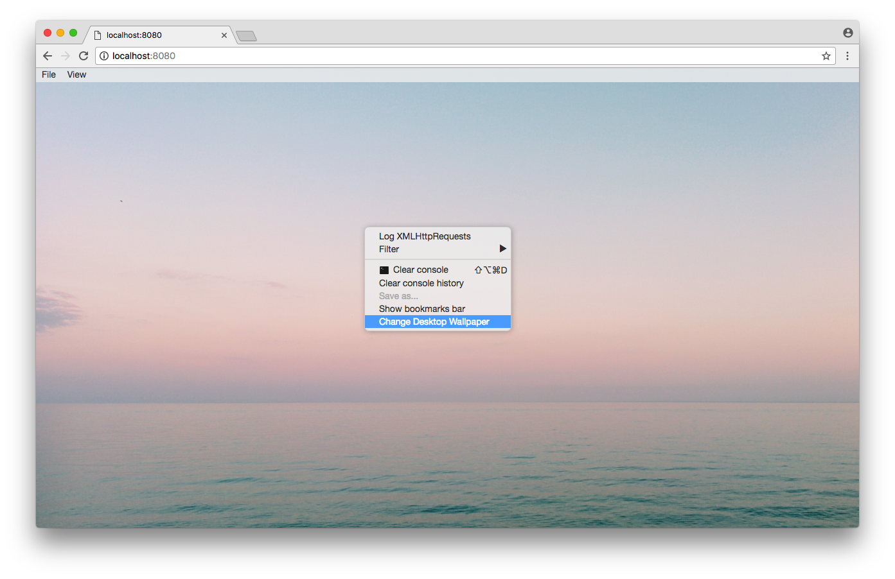

# NWJS Menu Browser

Browser Polyfill for [NWJS](http://docs.nwjs.io/en/latest/) [Menu](http://docs.nwjs.io/en/latest/References/Menu/) and [MenuItem](http://docs.nwjs.io/en/latest/References/MenuItem/).

## Why

My audio visualisation app [modV](http://github.com/2xAA/modV/) recently moved to NWJS and I had previously built my own (terrible) context menus for the browser. So as not to write two lots of code I thought I'd polyfill the browser so you could use the same code between NWJS and (presumably) Chrome!

This can also be used as a regular Context Menu library if so wished 😎

## Caveats

Does not support ```createMacBuiltIn```, ```MenuItem.key``` or ```MenuItem.modifiers```, though usage of these will not break existing code and will be displayed in the menu nodes.

These menus are not checked against any OS menu specification, but it's close enough to polyfill for the browser.
If you'd like more accurate functionality, PRs and enhancement issues are welcome!

## Usage

### Demo

Run ```npm run watch``` and a browser window pointing to ```localhost:8080``` will open.

### Build

Build using ```npm run build```, ```menu.js``` will be in ```./dist```.
*Coming to npm soon*

### Including in your project

The included stylesheet in `dist` is optional, but you will need some sort of style for your menus.
```HTML
<link rel=stylesheet type=text/css href=nwjs-menu-browser.css>
```

#### ES6
```JavaScript
import { Menu, MenuItem } from 'nwjs-menu-browser';

if(!nw) {
  var nw = {};
  nw.Menu = Menu;
  nw.MenuItem = MenuItem;
}
```

#### ES5
```JavaScript
if(!nw) {
  var nw = {};
  nw.Menu = require('nwjs-menu-browser').Menu;
  nw.MenuItem = require('nwjs-menu-browser').MenuItem;
}
```

#### Script Tag
```HTML
<script src=nwjs-menu-browser.js></script>
<script>
if(!nw) {
  var nw = {};
  nw.Menu = window.nwjsMenuBrowser.Menu;
  nw.MenuItem = window.nwjsMenuBrowser.MenuItem;
}
</script>
```
## Screenshots
The included stylesheet (```nwjs-menu-browser.css```) is a close match to macOS Sierra's menus.
If somebody would like to contribute extra 'themes' I'd be very happy 😘



